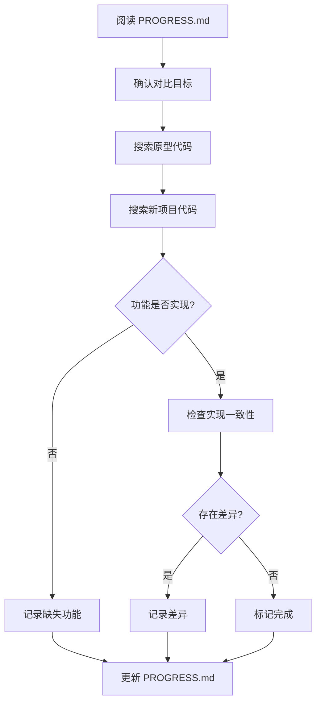

---
description: 对比原型代码，检查项目功能完成度
---

// turbo-all

# 功能对比与验收流程

> **目标**：对比原型代码与 XXZ 新项目，确认功能实现进度和完整度。

---

## 对比流程



---

## 1. 前置准备

### 步骤 1：了解当前进度

```
查看 xxz/PROGRESS.md 了解项目进度和待验收功能
```

### 步骤 2：确认对比目标

明确要对比的具体功能模块，例如：
- 攻击计算 / 伤害公式
- 物品掉落 / 概率系统
- NPC 对话 / 任务系统
- 技能释放 / BUFF 计算

---

## 2. 定位代码

### 步骤 3：搜索原型代码

```powershell
# 按文件名搜索 (替换 *Keyword*)
Get-ChildItem -Path src_v1_to_v2_community -Recurse -Include *.pas,*.cpp,*.h -Filter "*Keyword*"
```

```powershell
# 按内容搜索 (替换 pattern)
Get-ChildItem -Path src_v1_to_v2_community -Recurse -Include *.pas,*.cpp | Select-String -Pattern "pattern"
```

> [!TIP]
> 主要参考 `src_v1_to_v2_community`，如需查看更纯净的实现可参考 `src_v1_official`。

### 步骤 4：搜索新项目代码

```powershell
Get-ChildItem -Path xxz\src -Recurse -Include *.pas | Select-String -Pattern "pattern"
```

---

## 3. 对比分析

### 步骤 5：代码逻辑比对

| 对比项 | 关注点 |
|--------|--------|
| **数据结构** | `record` / `class` 字段是否一致？ |
| **核心算法** | 伤害公式、概率计算等是否一致？ |
| **协议结构** | 网络封包定义是否一致？(参考 `protocol.md`) |
| **缺失功能** | 原型中有但新项目中未实现的部分 |
| **优化改进** | 新项目是否有更好的实现？ |

---

## 4. 结果记录

### 步骤 6：更新进度文档

**功能已完成：** 在 `xxz/PROGRESS.md` 中标记为 `[x]`

**功能未完成：** 添加 TODO 备注，列出缺失细节

### 步骤 7：同步设计文档

如发现原型中有重要功能未在 `design.md` 中列出，请补充。
