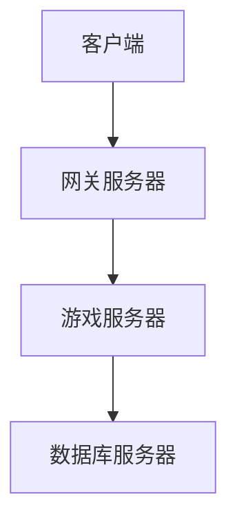
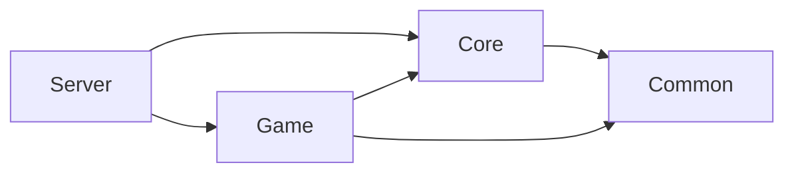

# 设计类任务工作流

## 🎯 适用场景

- 现代架构设计（阶段 4）
- 服务拆分方案设计
- 技术栈选型
- 通信架构设计
- 部署方案设计

## 🔑 触发关键词

`设计`、`架构`、`规划`、`方案`、`选型`、`拆分`

## 📋 执行步骤

### 1. 理解设计需求
- 确认设计范围（全局架构 / 子系统设计）
- 明确非功能性需求
  - 性能目标（并发数、延迟）
  - 可扩展性要求
  - 可维护性要求
  - 安全要求

### 2. 分析现有系统（基于前期逆向成果）
// turbo
- 读取阶段 0-3 的分析文档
- 识别现有系统的优缺点
- 提取可复用的设计思路
- 列出必须改进的问题

### 3. 技术栈选型

#### 必选技术
- **语言**：Golang 1.21+
- **网络库**：net / gorilla/websocket
- **数据库**：根据需求选择（MySQL/PostgreSQL/SQLite）

#### 可选技术
- **Web 框架**：Gin / Echo / 标准库 net/http
- **ORM**：GORM / sqlx / 原生 database/sql
- **序列化**：JSON / Protocol Buffers / MessagePack
- **缓存**：sync.Map / groupcache / Redis (go-redis)
- **日志**：zap / logrus / slog (标准库)

每项选型必须说明：
- ✅ 优点
- ❌ 缺点
- 🎯 选择理由

### 4. 设计架构方案

#### 4.1 服务拆分
遵循原则：
- **扁平化优先**（2-3 层目录）
- **按功能聚合**（避免过度拆分）
- **性能优先**（避免过度抽象）

常见拆分模式：
```
Option A: 单体架构（推荐小型项目）
├── GameServer（包含所有功能）
└── DBServer（数据持久化）

Option B: 分层架构（推荐中型项目）
├── LoginServer（认证）
├── GateServer（网关）
├── GameServer（游戏逻辑）
└── DBServer（数据持久化）

Option C: 微服务架构（大型项目）
├── AuthService
├── PlayerService
├── CombatService
├── ItemService
└── ...
```

#### 4.2 目录结构设计
示例（遵循 Go 项目标准布局）：
```
project/
├── cmd/              # 可执行文件入口
│   ├── login/        # 登录服务器
│   ├── gate/         # 网关服务器
│   └── game/         # 游戏服务器
├── internal/         # 私有应用代码
│   ├── domain/       # 领域模型
│   │   ├── player/
│   │   ├── combat/
│   │   ├── item/
│   │   └── quest/
│   ├── service/      # 业务逻辑层
│   ├── repository/   # 数据访问层
│   └── handler/      # 请求处理层
├── pkg/              # 可被外部使用的库
│   ├── protocol/     # 网络协议
│   ├── config/       # 配置管理
│   ├── database/     # 数据库工具
│   ├── logger/       # 日志工具
│   └── util/         # 通用工具
├── api/              # API 定义（protobuf/openapi）
├── configs/          # 配置文件
├── scripts/          # 构建和部署脚本
├── test/             # 额外的测试数据
└── go.mod            # Go 模块定义
```

#### 4.3 通信架构
- 选择通信协议（TCP/UDP/WebSocket）
- 设计消息路由机制
- 设计会话管理
- 设计负载均衡策略（如需要）

### 5. 绘制架构图

使用 Mermaid 绘制：

#### 系统架构图


#### 模块依赖图


### 6. 编写架构决策记录（ADR）

每个重要决策必须记录：

```markdown
## ADR-001: 使用标准库为主的轻量级技术栈

**状态**：已接受

**上下文**：
需要一个高性能、易维护的 Golang 技术栈来重写 MMORPG 服务器

**决策**：
优先使用 Go 标准库，必要时选择成熟轻量的第三方库

**理由**：
- 高性能（Go 原生并发、高效网络）
- 易维护（标准库稳定、API 简洁）
- 低依赖（减少外部依赖风险）
- 学习成本低（标准库文档完善）

**后果**：
- 某些功能需要自己实现
- 但代码更可控、调试更容易
```

### 7. 编写实施计划

#### 分阶段实施
```
第一轮：核心框架（项目结构、网络、数据库、日志）
第二轮：认证系统（注册、登录、Session）
第三轮：角色系统（创建、列表、删除）
...
```

#### 每阶段明确：
- 输入（依赖的前置条件）
- 输出（交付物）
- 验证标准

### 8. 生成输出文档

#### Markdown 文档结构
```markdown
# 技术架构设计

## 用户审核要求
> [!WARNING]
> 重大设计决策...

## 架构方案
### 服务拆分
### 目录结构
### 技术栈选型

## 通信架构

## 架构决策记录（ADR）

## 实施计划

## 风险评估
```

#### JSON 配置
```json
{
  "architecture": {
    "services": [...],
    "directories": {...},
    "tech_stack": {...}
  }
}
```

### 9. 提交审核
按照以下格式：

```
🛑 检查点 4：【架构设计】完成

【关键决策】
- 决策 1
- 决策 2

【输出文档】
- 📄 04_TechnicalArchitecture.md
- 📄 04_architecture.json

【需要确认】
- [ ] 服务拆分方案是否合理？
- [ ] 技术栈选型是否可接受？
- [ ] 目录结构是否清晰？

⚠️ **批准后才能进入实现阶段**

【用户选项】
1. 输入"批准" - 进入实现阶段
2. 输入"修改 XXX" - 调整方案
3. 输入"重新设计" - 推翻重来
```

## ⚠️ 注意事项

1. **遵循 KISS 原则**：避免过度设计
2. **性能优先**：避免过度抽象
3. **可维护性**：代码要简单清晰
4. **安全第一**：设计阶段就要考虑安全
5. **文档驱动**：未经批准不得开始编码

## 🚫 设计约束

### 红线（禁止）
- ❌ 不允许全局可变变量（只读常量可以）
- ❌ 不允许循环包依赖（Go 编译器会报错）
- ❌ 不允许跨层直接访问（必须通过接口）
- ❌ 不允许硬编码配置
- ❌ 不允许不安全的指针操作

### 黄线（需说明理由）
- ⚠️ 使用 interface{} (any) 而非具体类型
- ⚠️ 手写 SQL 而非 ORM
- ⚠️ 使用 unsafe 包
- ⚠️ 使用 panic/recover 做常规错误处理

## ✅ 输出检查清单

- [ ] 服务拆分方案清晰
- [ ] 目录结构合理
- [ ] 技术栈选型有理由
- [ ] 架构图完整（系统图、模块图、通信图）
- [ ] ADR 记录完整
- [ ] 实施计划可行
- [ ] 风险已识别
- [ ] 检查点格式正确
