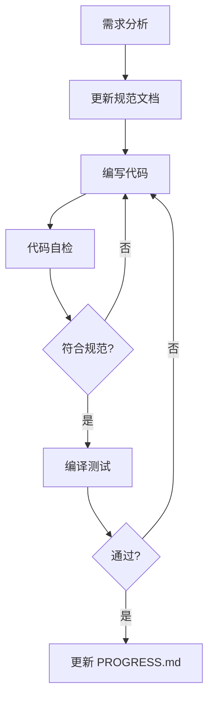

---
description: 仙侠传 (XXZ) 项目开发流程规范
---

// turbo-all

# 开发流程规范

> **目标**：确保跨会话开发时代码质量和一致性。

---

## 1. 新会话启动流程

每个新会话开始时，**必须按顺序执行以下步骤**：

### 步骤 1：阅读项目上下文
```
查看文件 .agent/rules/context.md
```

### 步骤 2：了解当前进度
```
查看 xxz/PROGRESS.md 了解项目进度
```

### 步骤 3：根据任务类型阅读相关规范

> 规范文档位置：`xxz/docs/specs/`

| 任务类型 | 需阅读的规范 |
|----------|-------------|
| 编写代码 | `codestyle.md`, `patterns.md` |
| 网络通信 | `protocol.md` |
| 新增接口 | `interfaces.md` |
| 数据结构 | `datamodel.md` |
| 错误处理 | `errors.md` |
| 项目全貌 | `design.md` |

---

## 2. 代码开发流程

### 2.1 新增功能流程



### 2.2 新增协议消息

使用 `/newproto` workflow

### 2.3 新增游戏模块

使用 `/newmod` workflow

---

## 3. 项目构建

> **编译方式**：使用 Delphi 12.3 IDE 手动编译

### 3.1 编译服务端

在 Delphi IDE 中依次编译：

1. `xxz/src/Server/BalanceServer/BalanceServer.dproj`
2. `xxz/src/Server/GateServer/GateServer.dproj`
3. `xxz/src/Server/LoginServer/LoginServer.dproj`
4. `xxz/src/Server/DBServer/DBServer.dproj`
5. `xxz/src/Server/GameServer/GameServer.dproj`

### 3.2 编译客户端

- `xxz/src/Client/Client.dproj`

---

## 4. 运行与测试

### 4.1 启动服务端（按顺序）

```powershell
# 1. DBServer
cd xxz\build\Server\DBServer; .\DB.exe

# 2. LoginServer
cd xxz\build\Server\LoginServer; .\Login.exe

# 3. GameServer
cd xxz\build\Server\GameServer; .\Game.exe

# 4. GateServer
cd xxz\build\Server\GateServer; .\Gate.exe

# 5. BalanceServer
cd xxz\build\Server\BalanceServer; .\Balance.exe
```

### 4.2 测试客户端
// turbo
```powershell
cd xxz\build\Client; .\Client.exe
```
