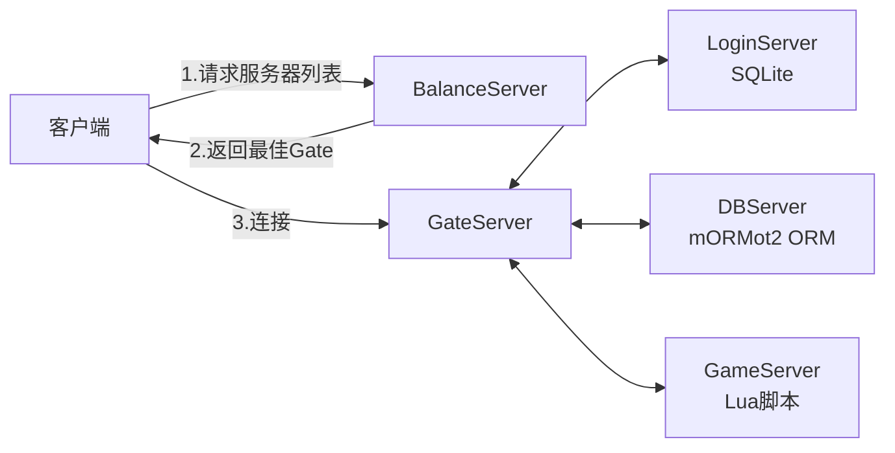

# 仙侠传 (XXZ) - 技术架构

> 技术选型和架构设计详情

---

## 服务端架构

| 服务 | 职责 | 存储 |
|------|------|------|
| **BalanceServer** | 负载均衡，返回最佳 Gate | 无 |
| **GateServer** | 客户端接入，消息路由转发 | 无 |
| **LoginServer** | 账号验证、角色列表 | SQLite |
| **DBServer** | 角色数据持久化 | mORMot2 ORM + 整库 AES 加密 (`.xxzdb`) |
| **GameServer** | 游戏核心逻辑 | Lua 脚本 |

---

## 技术选型

| 类别 | 选择 | 说明 |
|------|------|------|
| **语言** | Delphi 12.3 | AOT 编译，反编译保护好 |
| **基础框架** | mORMot2 (最大化使用) | 高性能、模块化 |
| **服务端 UI** | VCL 窗体 | 可视化界面，显示日志和服务状态 |
| **协议** | 自定义二进制 | 紧凑高效 |
| **配置** | INI (服务器) / SDB (游戏数据) | 兼容原版数据 |
| **角色数据存储** | mORMot2 ORM + 整库 AES 加密 | 自定义 `.xxzdb` 格式 |
| **客户端渲染** | DirectX 11 | 现代渲染，支持 PNG 透明 |
| **脚本** | Lua | 服务端 NPC/任务，客户端插件 |

---

## mORMot2 组件

| 功能 | 组件 | 用途 |
|------|------|------|
| 异步网络 | `mormot.net.async` | TCP 服务端/客户端 |
| 日志 | `mormot.core.log` | 多级别日志、异常追踪 |
| 加密 | `mormot.crypt.core`, `mormot.crypt.ecc` | AES-256-GCM, ECDH |
| SQLite | `mormot.db.raw.sqlite3` | LoginServer 账号存储 |
| ORM | `mormot.orm.core` | DBServer 角色数据 |
| JSON | `mormot.core.json` | 配置文件、调试输出 |
| 线程安全 | `TSynDictionary`, `TSynQueue` | 在线玩家管理 |
| 字符串 | `RawUtf8`, `mormot.core.text` | 高效字符串处理 |

> [!NOTE]
> mORMot2 是模块化设计，只需 `uses` 需要的单元即可。

---

## 关键技术决策

| 决策 | 选择 | 原因 |
|------|------|------|
| 数据兼容 | 兼容原版 SDB | 零迁移成本，使用原有策划数据 |
| 协议设计 | 全新设计 | 不受历史包袱限制，更安全 |
| 加密方案 | AES-256-GCM + ECDH | 防脱机外挂，前向安全 |
| 配置格式 | INI (服务器配置) | 支持注释，TIniFile 原生支持 |
| 游戏数据 | SDB (CSV) | 兼容原版，Excel 可编辑 |

---

## 安全措施

| 措施 | 实现 |
|------|------|
| **传输加密** | AES-256-GCM + ECDH 密钥交换 |
| **防重放** | 序列号递增 + 滑动窗口检测 |
| **防篡改** | GCM 认证标签 |
| **前向安全** | 每次连接使用新的 ECDH 密钥对 |
| **服务端权威** | 所有游戏逻辑在服务端计算 |
| **行为检测** | 检测异常操作频率、移动轨迹 |
