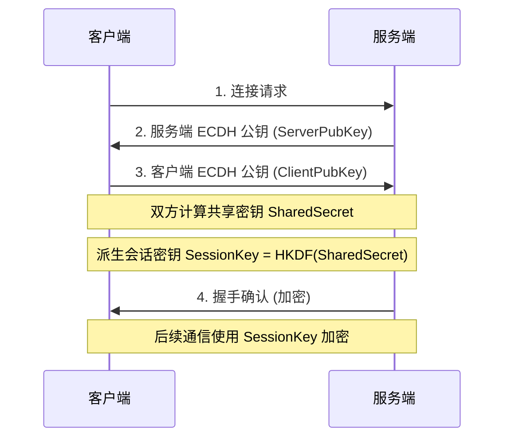

# 网络协议规范

> **适用范围**：仙侠传 (XXZ) 项目所有网络通信

---

## 1. 数据包格式

### 1.1 基本结构

```
+----------------+------------------+-------------------+
|   包头 (8字节)  |   数据体 (变长)   |   包尾 (2字节)    |
+----------------+------------------+-------------------+
```

### 1.2 包头结构 (TPacketHeader)

| 偏移 | 长度 | 字段 | 类型 | 说明 |
|------|------|------|------|------|
| 0 | 2 | PacketStart | Word | 包起始标记 `$AA55` |
| 2 | 2 | PacketSize | Word | 整包长度（含包头包尾） |
| 4 | 2 | MessageType | Word | 消息类型 |
| 6 | 2 | Sequence | Word | 序列号（用于请求/响应匹配） |

### 1.3 包尾

| 偏移 | 长度 | 字段 | 类型 | 说明 |
|------|------|------|------|------|
| N-2 | 2 | PacketEnd | Word | 包结束标记 `$55AA` |

### 1.4 Delphi 定义

```pascal
const
  PACKET_START = $AA55;
  PACKET_END   = $55AA;
  MAX_PACKET_SIZE = 8192;
  HEADER_SIZE = 8;
  FOOTER_SIZE = 2;

type
  TPacketHeader = packed record
    PacketStart: Word;    // $AA55
    PacketSize: Word;     // 整包长度
    MessageType: Word;    // 消息类型
    Sequence: Word;       // 序列号
  end;

  TPacketData = packed record
    Header: TPacketHeader;
    Data: array[0..MAX_PACKET_SIZE - HEADER_SIZE - FOOTER_SIZE - 1] of Byte;
  end;
```

---

## 2. 字节序

| 规则 | 说明 |
|------|------|
| 字节序 | **Little-Endian** (x86 原生) |
| 字符串 | UTF-8 编码，前置 2 字节长度 |
| 布尔值 | 1 字节，0=False，1=True |

### 2.1 字符串格式

```
+-------------+------------------+
| 长度 (2字节) | 内容 (UTF-8)     |
+-------------+------------------+
```

---

## 3. 加密规范

### 3.1 加密架构

```
┌─────────────────────────────────────────────────────────────┐
│                      安全通信层                              │
├─────────────────────────────────────────────────────────────┤
│  1. ECDH 密钥交换 (secp256r1)                               │
│  2. AES-256-GCM 对称加密                                    │
│  3. 序列号防重放                                            │
│  4. HMAC-SHA256 消息签名                                    │
└─────────────────────────────────────────────────────────────┘
```

### 3.2 握手流程



### 3.3 数据包加密格式

```
+----------+----------+------------------+----------+
| 序列号   | 时间戳   | 加密数据         | 认证标签 |
| (4字节)  | (8字节)  | (变长)           | (16字节) |
+----------+----------+------------------+----------+
```

| 字段 | 长度 | 说明 |
|------|------|------|
| Sequence | 4 | 递增序列号，防重放 |
| Timestamp | 8 | 毫秒时间戳，防延迟重放 |
| EncryptedData | 变长 | AES-256-GCM 加密的原始数据 |
| AuthTag | 16 | GCM 认证标签 |

### 3.4 密钥派生

```pascal
// 使用 HKDF 从共享密钥派生会话密钥
SessionKey := HKDF_SHA256(
  SharedSecret,    // ECDH 共享密钥
  Salt,            // 随机盐值
  Info,            // 'session_key'
  32               // 输出 256 位密钥
);
```

### 3.5 Delphi 定义

```pascal
type
  TECDHKeyPair = record
    PublicKey: array[0..64] of Byte;   // 未压缩格式公钥
    PrivateKey: array[0..31] of Byte;  // 私钥
  end;

  TSecureSession = class
  private
    FSessionKey: array[0..31] of Byte;  // AES-256 密钥
    FSequence: Cardinal;                 // 发送序列号
    FExpectedSeq: Cardinal;              // 期望接收序列号
    FLastTimestamp: Int64;               // 最后时间戳
  public
    /// <summary>执行 ECDH 密钥交换</summary>
    procedure Handshake(const aRemotePubKey: TBytes);
    /// <summary>加密数据包</summary>
    function Encrypt(const aData: TBytes): TBytes;
    /// <summary>解密并验证数据包</summary>
    function Decrypt(const aData: TBytes; out aResult: TBytes): Boolean;
  end;

const
  // 加密相关常量
  ECDH_CURVE = 'secp256r1';
  AES_KEY_SIZE = 32;       // 256 位
  GCM_NONCE_SIZE = 12;
  GCM_TAG_SIZE = 16;
  SEQUENCE_SIZE = 4;
  TIMESTAMP_SIZE = 8;
  
  // 时间戳容差 (5 分钟)
  TIMESTAMP_TOLERANCE = 5 * 60 * 1000;
  
  // 序列号窗口大小 (防重放)
  SEQUENCE_WINDOW = 1000;
```

### 3.6 安全措施

| 措施 | 实现 |
|------|------|
| **防重放** | 序列号递增 + 滑动窗口检测 |
| **防延迟重放** | 时间戳验证 (±5分钟容差) |
| **防篡改** | AES-GCM 自带认证 |
| **前向安全** | 每次连接使用新的 ECDH 密钥对 |
| **密钥泄露防护** | 会话密钥不存储，仅内存保存 |

### 3.7 握手消息定义

#### mtHandshakeInit (0x0003)

**服务端 → 客户端**：

| 偏移 | 长度 | 字段 | 类型 | 说明 |
|------|------|------|------|------|
| 0 | 65 | ServerPubKey | Bytes | 服务端 ECDH 公钥 |
| 65 | 32 | Salt | Bytes | HKDF 盐值 |

#### mtHandshakeResponse (0x0004)

**客户端 → 服务端**：

| 偏移 | 长度 | 字段 | 类型 | 说明 |
|------|------|------|------|------|
| 0 | 65 | ClientPubKey | Bytes | 客户端 ECDH 公钥 |

#### mtHandshakeComplete (0x0005)

**服务端 → 客户端** (已加密)：

| 偏移 | 长度 | 字段 | 类型 | 说明 |
|------|------|------|------|------|
| 0 | 1 | Result | Byte | 0=成功 |

---


## 4. 消息类型定义

### 4.1 消息类型枚举

```pascal
type
  TMessageType = (
    // 系统消息 (0x00xx)
    mtNone              = $0000,
    mtHeartbeat         = $0001,  // 心跳
    mtHandshakeInit     = $0003,  // 握手初始化 (服务端发送公钥)
    mtHandshakeResponse = $0004,  // 握手响应 (客户端发送公钥)
    mtHandshakeComplete = $0005,  // 握手完成 (加密确认)

    // 登录消息 (0x01xx)
    mtLoginRequest    = $0100,  // 登录请求
    mtLoginResponse   = $0101,  // 登录响应
    mtLogout          = $0102,  // 登出
    mtRegister        = $0103,  // 注册账号

    // 角色消息 (0x02xx)
    mtCharList        = $0200,  // 角色列表
    mtCharCreate      = $0201,  // 创建角色
    mtCharDelete      = $0202,  // 删除角色
    mtCharSelect      = $0203,  // 选择角色
    mtCharEnterWorld  = $0204,  // 进入世界

    // 移动消息 (0x03xx)
    mtMove            = $0300,  // 移动
    mtStopMove        = $0301,  // 停止移动
    mtTeleport        = $0302,  // 传送

    // 战斗消息 (0x04xx)
    mtAttack          = $0400,  // 攻击
    mtSkill           = $0401,  // 使用技能
    mtDamage          = $0402,  // 伤害
    mtDeath           = $0403,  // 死亡
    mtRevive          = $0404,  // 复活

    // 物品消息 (0x05xx)
    mtItemList        = $0500,  // 物品列表
    mtItemUse         = $0501,  // 使用物品
    mtItemDrop        = $0502,  // 丢弃物品
    mtItemPickup      = $0503,  // 拾取物品
    mtItemEquip       = $0504,  // 装备物品
    mtItemUnequip     = $0505,  // 卸下装备

    // 聊天消息 (0x06xx)
    mtChatNormal      = $0600,  // 普通聊天
    mtChatWhisper     = $0601,  // 私聊
    mtChatGuild       = $0602,  // 门派聊天
    mtChatWorld       = $0603,  // 世界聊天

    // BUFF 消息 (0x07xx)
    mtBuffAdd         = $0700,  // 添加 BUFF
    mtBuffRemove      = $0701,  // 移除 BUFF
    mtBuffList        = $0702,  // BUFF 列表

    // 好友消息 (0x08xx)
    mtFriendList      = $0800,  // 好友列表
    mtFriendAdd       = $0801,  // 添加好友
    mtFriendRemove    = $0802,  // 删除好友
    mtFriendOnline    = $0803,  // 好友上线通知

    // 邮件消息 (0x09xx)
    mtMailList        = $0900,  // 邮件列表
    mtMailSend        = $0901,  // 发送邮件
    mtMailRead        = $0902,  // 阅读邮件
    mtMailDelete      = $0903,  // 删除邮件
    mtMailTakeItem    = $0904,  // 取出附件

    // 拍卖消息 (0x0Axx)
    mtAuctionList     = $0A00,  // 拍卖列表
    mtAuctionSell     = $0A01,  // 上架物品
    mtAuctionBuy      = $0A02,  // 购买物品
    mtAuctionCancel   = $0A03,  // 取消拍卖

    // 结婚消息 (0x0Bxx)
    mtMarryPropose    = $0B00,  // 求婚
    mtMarryAccept     = $0B01,  // 接受求婚
    mtMarryReject     = $0B02,  // 拒绝求婚
    mtDivorce         = $0B03,  // 离婚

    // 任务消息 (0x0Cxx)
    mtQuestList       = $0C00,  // 任务列表
    mtQuestAccept     = $0C01,  // 接受任务
    mtQuestComplete   = $0C02,  // 完成任务
    mtQuestAbandon    = $0C03   // 放弃任务
  );
```

### 4.2 消息类型分组

| 范围 | 分类 |
|------|------|
| 0x00xx | 系统消息 |
| 0x01xx | 登录相关 |
| 0x02xx | 角色相关 |
| 0x03xx | 移动相关 |
| 0x04xx | 战斗相关 |
| 0x05xx | 物品相关 |
| 0x06xx | 聊天相关 |
| 0x07xx | BUFF 相关 |
| 0x08xx | 好友相关 |
| 0x09xx | 邮件相关 |
| 0x0Axx | 拍卖相关 |
| 0x0Bxx | 结婚相关 |
| 0x0Cxx | 任务相关 |

---

## 5. 消息详细定义

> 本节定义每条消息的请求/响应结构。新增消息时必须在此添加定义。

### 5.1 系统消息

#### mtHeartbeat (0x0001)

**请求**：无数据体

**响应**：无数据体

---


### 5.2 登录消息

#### mtLoginRequest (0x0100)

**请求** (客户端 → GateServer)：

| 偏移 | 长度 | 字段 | 类型 | 说明 |
|------|------|------|------|------|
| 0 | 2+N | Account | String | 账号名 |
| N | 2+M | Password | String | 密码 (MD5) |

**响应** (GateServer → 客户端)：

| 偏移 | 长度 | 字段 | 类型 | 说明 |
|------|------|------|------|------|
| 0 | 1 | Result | Byte | 结果码 (0=成功) |
| 1 | 4 | UserID | Cardinal | 用户 ID (成功时) |

**结果码**：

| 值 | 含义 |
|----|------|
| 0 | 成功 |
| 1 | 账号不存在 |
| 2 | 密码错误 |
| 3 | 账号已登录 |
| 4 | 账号被封禁 |

---

### 5.3 角色消息

#### mtCharList (0x0200)

**请求**：无数据体

**响应**：

| 偏移 | 长度 | 字段 | 类型 | 说明 |
|------|------|------|------|------|
| 0 | 1 | Count | Byte | 角色数量 |
| 1 | N*X | Characters | Array | 角色列表 |

**角色项结构**：

| 偏移 | 长度 | 字段 | 类型 | 说明 |
|------|------|------|------|------|
| 0 | 4 | CharID | Cardinal | 角色 ID |
| 4 | 2+N | Name | String | 角色名 |
| N | 1 | Level | Byte | 等级 |
| N+1 | 1 | Job | Byte | 职业 |

---

### 5.4 待补充消息

> [!NOTE]
> 其他消息的详细定义将在实现对应功能时补充到此文档。

---

## 6. 服务间通信

### 6.1 内部消息类型

| 消息 | 值 | 说明 |
|------|------|------|
| imtServerRegister | 0xF000 | 服务注册 |
| imtServerHeartbeat | 0xF001 | 服务心跳 |
| imtForwardToLogin | 0xF100 | 转发到 LoginServer |
| imtForwardToDB | 0xF101 | 转发到 DBServer |
| imtForwardToGame | 0xF102 | 转发到 GameServer |

### 6.2 GateServer 消息转发

```
客户端 → GateServer: [原始消息]
GateServer → 目标服务: [ConnID(4) + 原始消息]
目标服务 → GateServer: [ConnID(4) + 响应消息]
GateServer → 客户端: [响应消息]
```

---

## 7. 协议版本

| 版本 | 日期 | 说明 |
|------|------|------|
| 1.0 | 2025-12-08 | 初始版本 |
